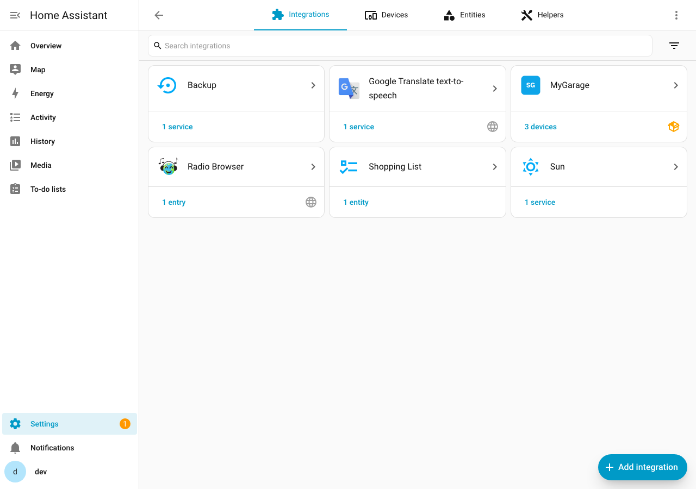
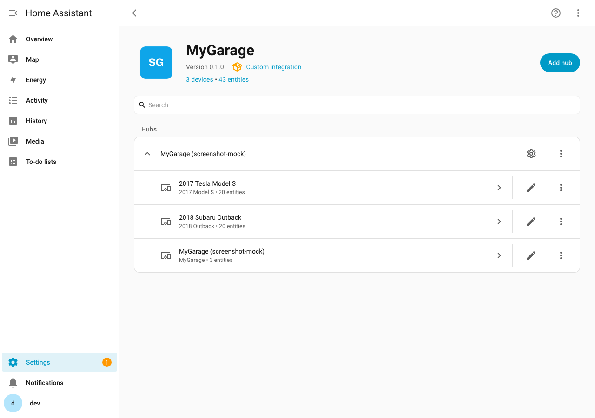
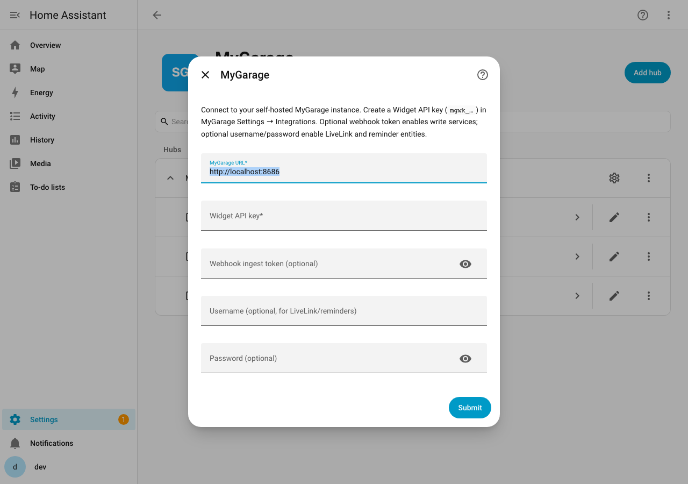
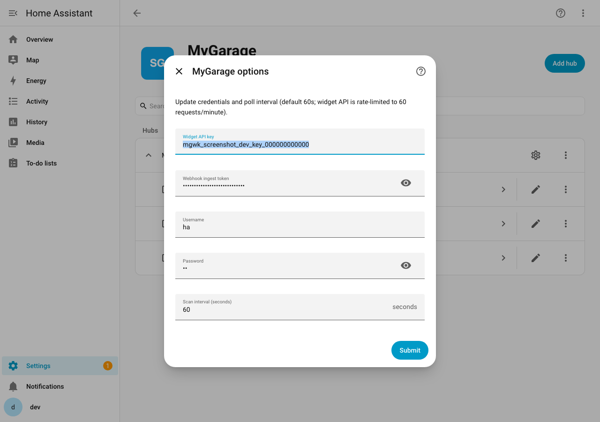
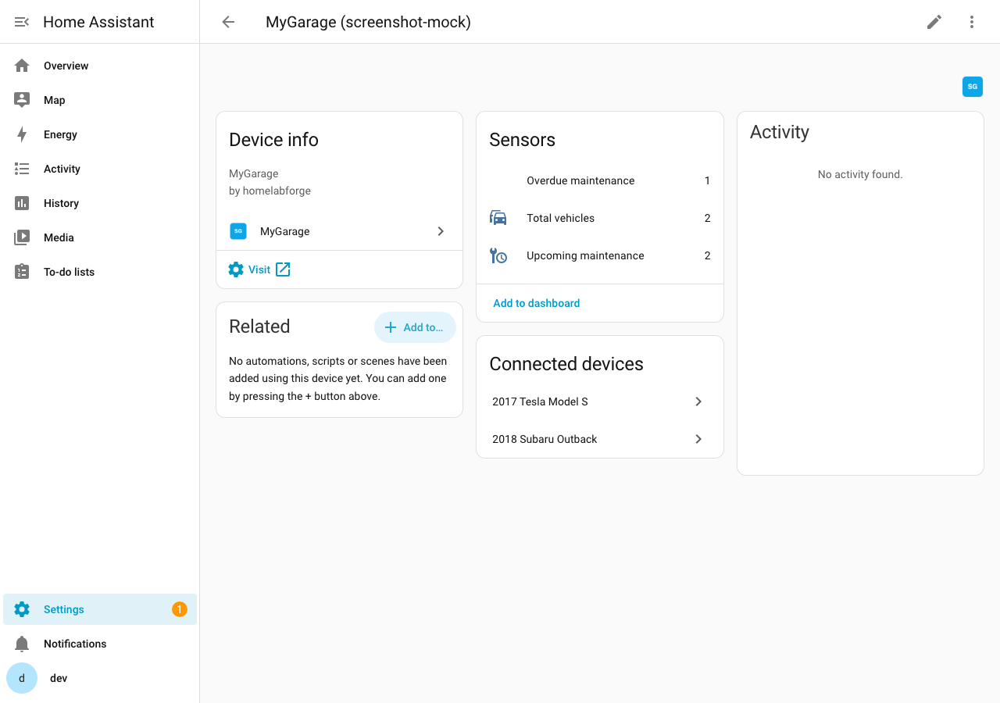
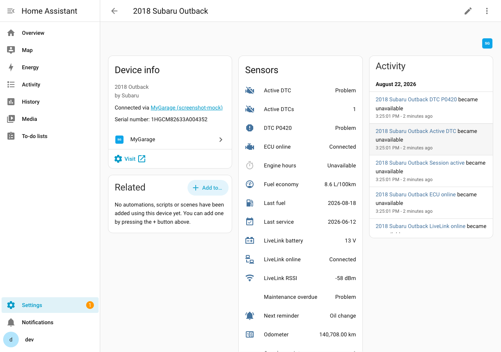

# MyGarage

Home Assistant custom integration for self-hosted [MyGarage](https://github.com/homelabforge/mygarage) — vehicles, maintenance, fuel, LiveLink.

[](https://github.com/Shaffer-Softworks/mygarage-ha/actions/workflows/validate.yaml)

## Screenshots

| Integrations list | Integration hubs & devices |
|---|---|
| [](docs/images/integrations.png) | [](docs/images/integration-detail.png) |

| Add / reconfigure hub | Options menu |
|---|---|
| [](docs/images/config-flow.png) | [](docs/images/options-menu.png) |

| Garage hub | Vehicle device |
|---|---|
| [](docs/images/garage-device.png) | [](docs/images/vehicle-device.png) |

## Features

- **Sensors** from the Widget API: garage totals, per-vehicle odometer, fuel economy, engine hours, maintenance counts, last service/fuel dates
- **Binary sensors**: maintenance overdue, LiveLink/ECU online, active session, active DTCs (optional per-code sensors)
- **LiveLink + reminders** (optional JWT login): battery, RSSI, telemetry, DTC counts, pending/next reminder
- **Services** via webhooks: `mygarage.log_fuel`, `mygarage.log_odometer`, `mygarage.complete_reminder`

## Prerequisites (MyGarage)

1. Run [homelabforge/mygarage](https://github.com/homelabforge/mygarage) (Docker on port **8686** by default).
2. Set auth mode to **`local`** or **`oidc`** (widget API keys do not work when auth is `none`).
3. Create a **Widget API key** (`mgwk_…`) under Settings → Integrations.
4. (Optional) Set a **webhook ingest token** for write services.
5. (Optional) Create a local user for LiveLink / reminder entities (JWT login).

## Install with HACS

### Custom repository (until default-feed merge)

1. HACS → ⋮ → **Custom repositories**
2. Add `https://github.com/Shaffer-Softworks/mygarage-ha` as **Integration**
3. Download **MyGarage**, restart Home Assistant
4. Settings → Devices & Services → **Add Integration** → **MyGarage**


### After HACS Default

Search for **MyGarage** in HACS → Integrations (no custom repo needed).

## Configuration

| Field | Required | Purpose |
|-------|----------|---------|
| URL | Yes | e.g. `http://192.168.1.10:8686` |
| Widget API key | Yes | `mgwk_…` |
| Webhook token | No | Enables write services |
| Username / password | No | Enables LiveLink, DTCs, reminders |

Options: update keys and poll interval (default **60s**; stay at or above 60s to respect the widget rate limit).


## Services

```yaml
service: mygarage.log_odometer
data:
  vin: "1HGCM82633A123456"
  odometer_km: 123456
```

```yaml
service: mygarage.log_fuel
data:
  vin: "1HGCM82633A123456"
  odometer_km: 123456
  liters: 45.2
  cost: 72.50
  is_full_tank: true
```

```yaml
service: mygarage.complete_reminder
data:
  vin: "1HGCM82633A123456"
  reminder_id: 42
```

## Example automation

```yaml
alias: Notify overdue MyGarage maintenance
triggers:
  - trigger: numeric_state
    entity_id: sensor.mygarage_overdue_maintenance
    above: 0
actions:
  - action: notify.mobile_app_phone
    data:
      title: MyGarage
      message: "Overdue maintenance items: {{ states('sensor.mygarage_overdue_maintenance') }}"
```

## Notes

- LiveLink **device ingest** (WiCAN / Torque) is configured in MyGarage itself; this integration only **reads** status/telemetry.
- OIDC users should create a local service account for JWT login in Home Assistant.
- Brand assets ship in-repo under `custom_components/mygarage/brand/` (HA 2026.3+).

## License

MIT — see [LICENSE](LICENSE).
